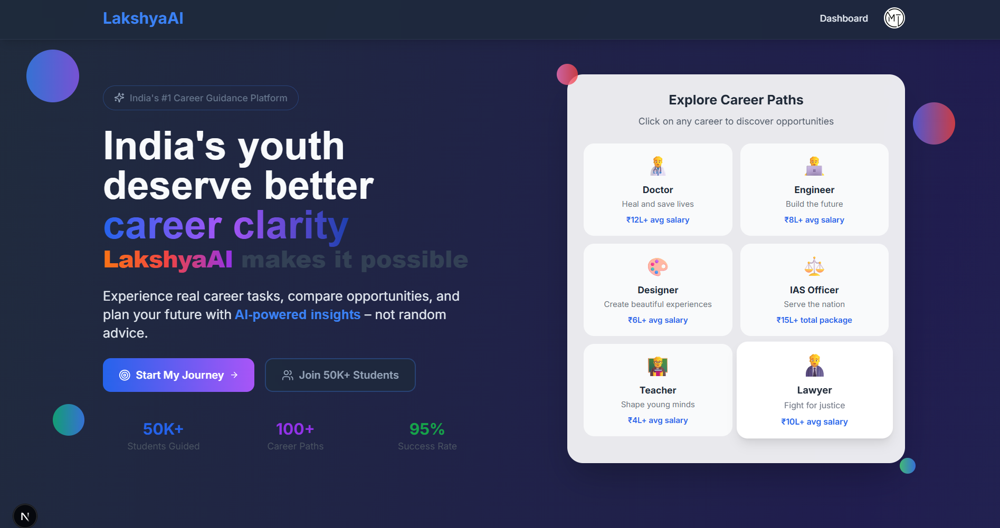
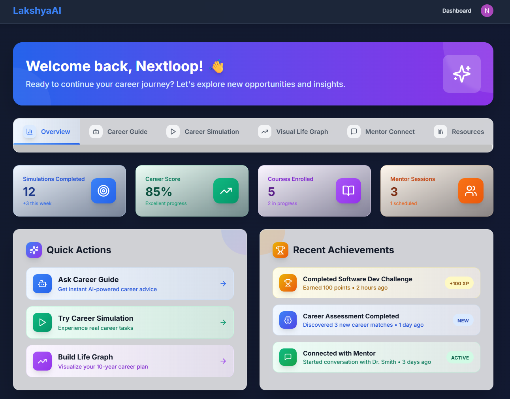
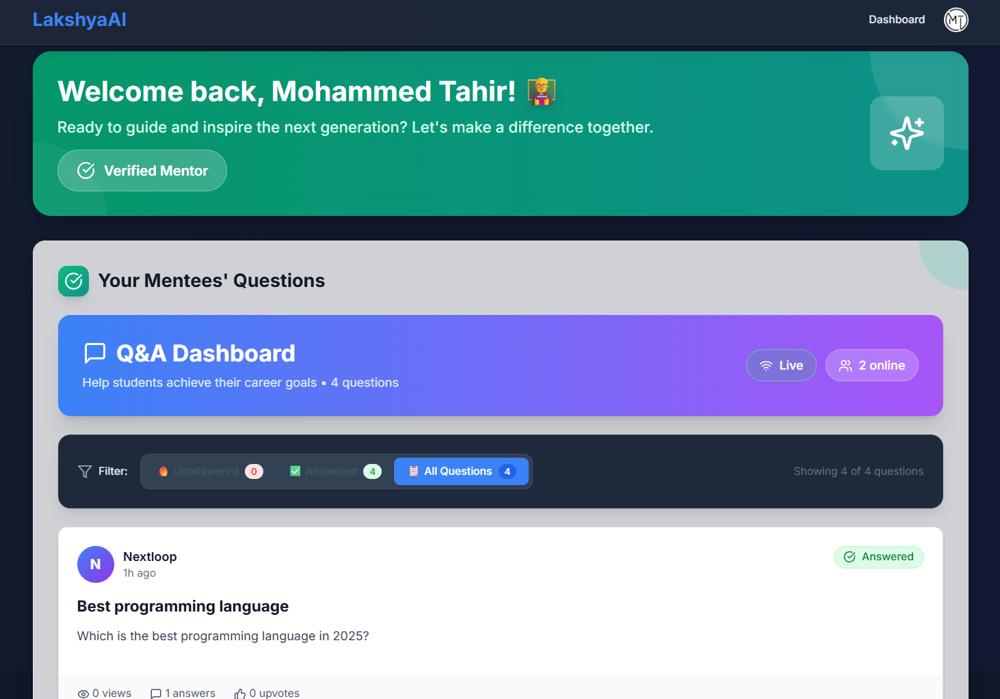
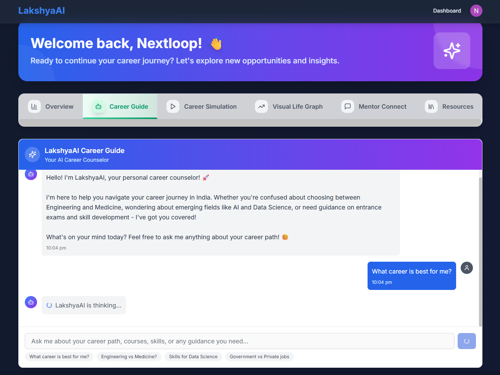
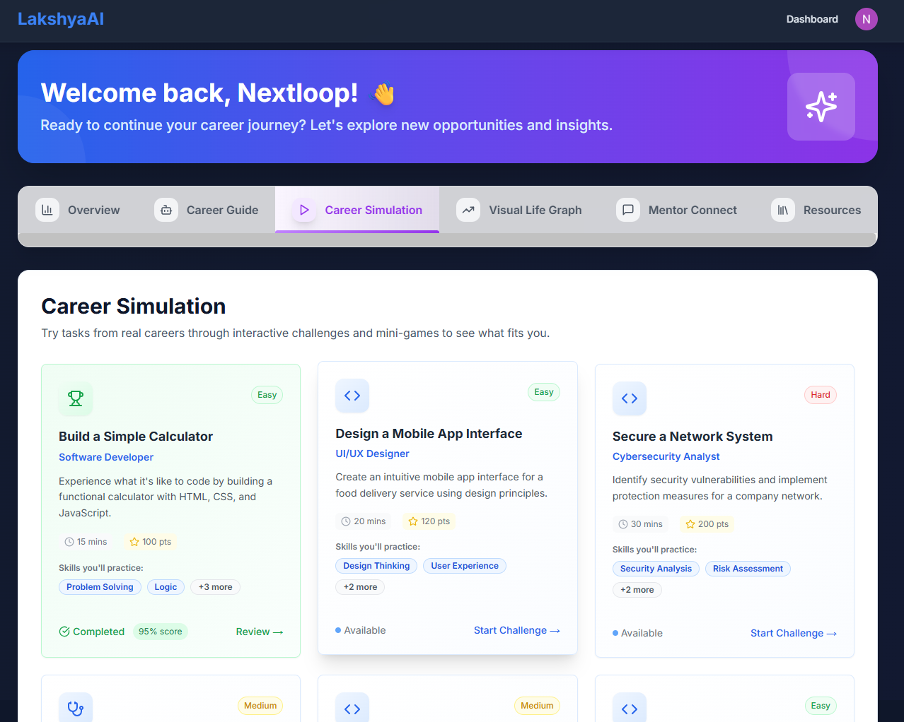
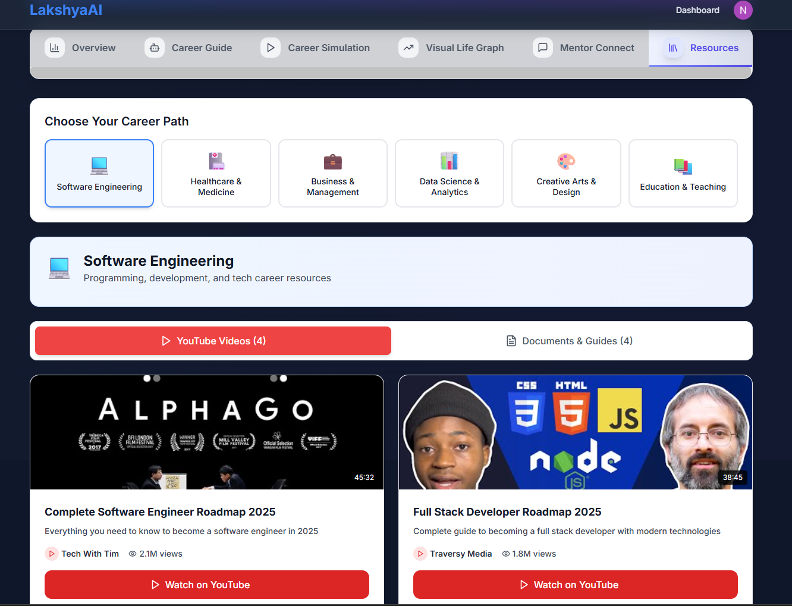

# LakshyaAI

### 🏠 Modern & Intuitive Interface


A clean, user-friendly interface that makes career exploration simple and engaging for students of all backgrounds.
***

### 🎓 Student Dashboard


Track your career journey, access learning resources, and monitor your progress all in one place.
***

### 👨‍🏫 Mentor Dashboard


Mentors can efficiently manage student queries and provide personalized guidance through an organized dashboard.
***
### 💬 AI-Powered Career Chat


Get instant, intelligent career advice from our AI assistant, available 24/7 to answer your questions.
***
### 🎮 Career Simulation


Experience different career paths through interactive simulations and real-world scenarios.
***
### 📚 Learning Resources


Access a curated collection of resources to support your career development journey.


## 🛠️ Tech Stack

- **Frontend**: Next.js 14, TypeScript, Tailwind CSS
- **Backend**: Node.js, Prisma, PostgreSQL
- **AI**: Google Gemini Pro
- **Authentication**: Clerk
- **Real-time**: Redis
- **Deployment**: Vercel + Railway

## 🚀 Quick Start

1. Clone the repository
2. Install dependencies: `npm install`
3. Set up environment variables
4. Run development server: `npm run dev`

## 📁 Project Structure

```
LakshyaAI/
├── app/          # Next.js app directory
├── components/   # Reusable components
├── hooks/        # Custom hooks
├── lib/          # Utilities and configs
├── prisma/       # Database schema
├── public/       # Static files
└── Images/       # Project screenshots
```

## 🚀 Getting Started

### **Prerequisites**
- Node.js 18+ and npm
- PostgreSQL database (or Supabase account)
- Redis instance (optional for real-time features)
- Clerk account for authentication

### **1. Clone the Repository**
```bash
git clone https://github.com/SnippetTechie/LakshyaAI.git
cd LakshyaAI
```

### **2. Install Dependencies**
```bash
npm install
```

### **3. Environment Setup**
Create a `.env.local` file in the root directory

### **4. Database Setup**
```bash
# Generate Prisma client
npm run db:generate

# Push database schema
npm run db:push

# Seed the database (optional)
npm run db:seed
```

### **5. Redis Setup (Optional)**
For real-time Q&A features, set up Redis:

**Option A: Local Redis**
```bash
# Install Redis locally
# Windows: Download from https://redis.io/download
# macOS: brew install redis
# Ubuntu: sudo apt install redis-server

# Start Redis
redis-server
```

**Option B: Railway Redis (Recommended)**
1. Visit [Railway.app](https://railway.app)
2. Create a new Redis service
3. Copy the connection URL to your `.env.local`

### **6. Run Development Server**
```bash
npm run dev
```

### **7. Open Your Browser**
Visit [http://localhost:3000](http://localhost:3000) to see LakshyaAI in action!

---

## 📱 Features Overview

### **For Students**
- 🎯 **Career Discovery**: Explore careers through interactive simulations
- ❓ **Ask Questions**: Get answers from verified industry mentors
- 📊 **Career Comparison**: Compare different career paths side-by-side
- 📈 **Progress Tracking**: Monitor your career exploration journey
- 🎮 **Gamified Learning**: Engage with career content through interactive tools

### **For Mentors**
- 💬 **Answer Questions**: Help students with career guidance
- 📋 **Mentor Dashboard**: Manage your mentoring activities
- 🏆 **Impact Tracking**: See how you're helping students grow
- ⚡ **Real-time Notifications**: Get notified of new questions instantly

### **For Administrators**
- 👥 **User Management**: Manage students and mentors
- 📊 **Analytics Dashboard**: Track platform usage and engagement
- ✅ **Mentor Verification**: Approve and verify mentor applications
- 🛠️ **Content Management**: Manage career data and simulations

---

## 🤝 Contributing

We welcome contributions from the community! Here's how you can help:

1. **Fork the repository**
2. **Create a feature branch**: `git checkout -b feature/amazing-feature`
3. **Commit your changes**: `git commit -m 'Add amazing feature'`
4. **Push to the branch**: `git push origin feature/amazing-feature`
5. **Open a Pull Request**

### **Development Guidelines**
- Follow TypeScript best practices
- Use Tailwind CSS for styling
- Write meaningful commit messages
- Test your changes thoroughly
- Update documentation as needed

---

## 🌟 Roadmap

### **Phase 1: Core Platform** ✅
- [x] User authentication and role management
- [x] Real-time Q&A system
- [x] Basic career exploration tools
- [x] Responsive UI design

### **Phase 2: Enhanced Features** 🚧
- [ ] AI-powered career recommendations
- [ ] Advanced career simulations
- [ ] Video call integration for mentoring
- [ ] Mobile app development

### **Phase 3: Scale & Growth** 📋
- [ ] Multi-language support
- [ ] Advanced analytics and insights
- [ ] Integration with educational institutions
- [ ] Career placement assistance

---


## 📄 License

This project is licensed under the MIT License - see the [LICENSE](LICENSE) file for details.

---


**Built with ❤️ for India's youth by the LakshyaAI team**

*Empowering the next generation with career clarity and confidence* 🚀
